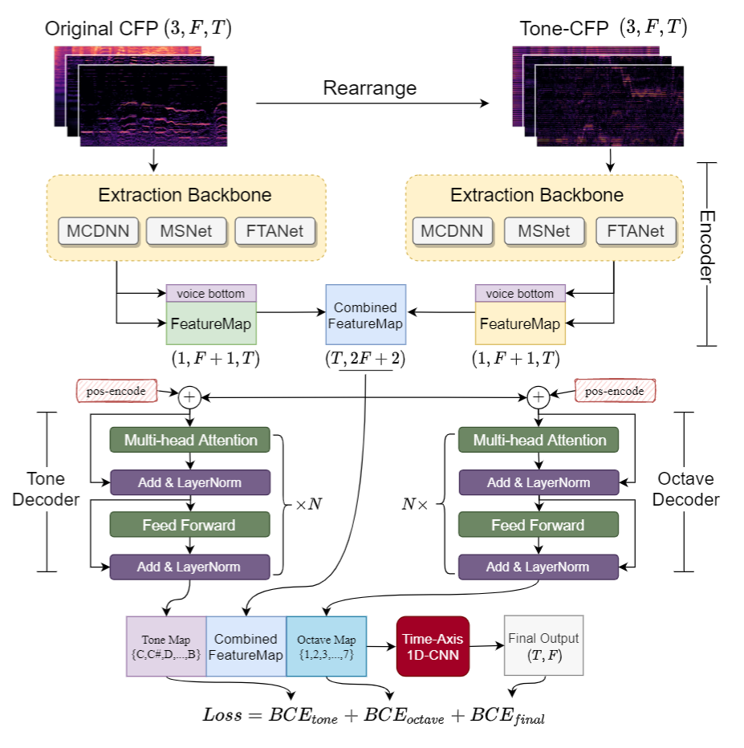

# TONet

## Introduction

The official implementation of "TONet: Tone-Octave Network for Singing Melody Extraction  from Polyphonic Music", in ICASSP 2022

We propose TONet, a plug-and-play model that improves both tone and octave perceptions by leveraging a novel input representation and a novel network architecture. Any CFP-input-based Model can be settled in TONet and lead to possible better performance.

<p align="center">

</p>

## Main Results on Extraction Performance

Experiments are done to verify the capability of TONet with various baseline backbone models. Our results show that tone-octave fusion with Tone-CFP can significantly improve the singing voice extraction performance across various datasets -- with substantial gains in octave and tone accuracy.

<p align="center">

</p>

## Getting Started

### Download Datasets

* [MIR-1k](https://sites.google.com/site/unvoicedsoundseparation/mir-1k)
* [ADC 2004 & MIREX05](https://labrosa.ee.columbia.edu/projects/melody/)
* [MedleyDB](https://medleydb.weebly.com/)

After downloading the data, use the txt files in the data folder, and process the CFP feature by [feature_extraction.py](feature_extraction.py).

### Overwrite the Configuration

The *config.py* contains all configurations you need to change and set.

### Train and Evaluation

```
python main.py train

python main.py test
```

## Produce the Estimation Digram

Uncomment the write prediction in [tonet.py](model/tonet.py)

<p align="center">

</p>

## Model Checkpoints

We provide the best TO-FTANet checkpoints in this [link](https://drive.google.com/drive/folders/1JklLSjmu2yF-QV16b8oO9ZltyoFUOC7t?usp=sharing). More checkpoints will be uploaded.

## Citing 
```
@inproceedings{tonet-ke2022,
  author = {Ke Chen, Shuai Yu, Cheng-i Wang, Wei Li, Taylor Berg-Kirkpatrick, Shlomo Dubnov},
  title = {TONet: Tone-Octave Network for Singing Melody Extraction  from Polyphonic Music},
  booktitle = {{ICASSP} 2022}
}
```

